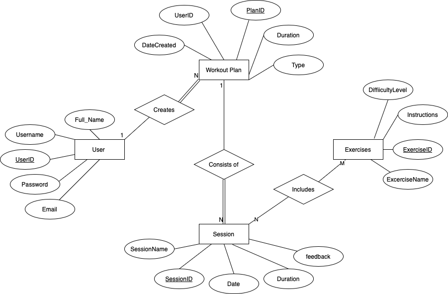
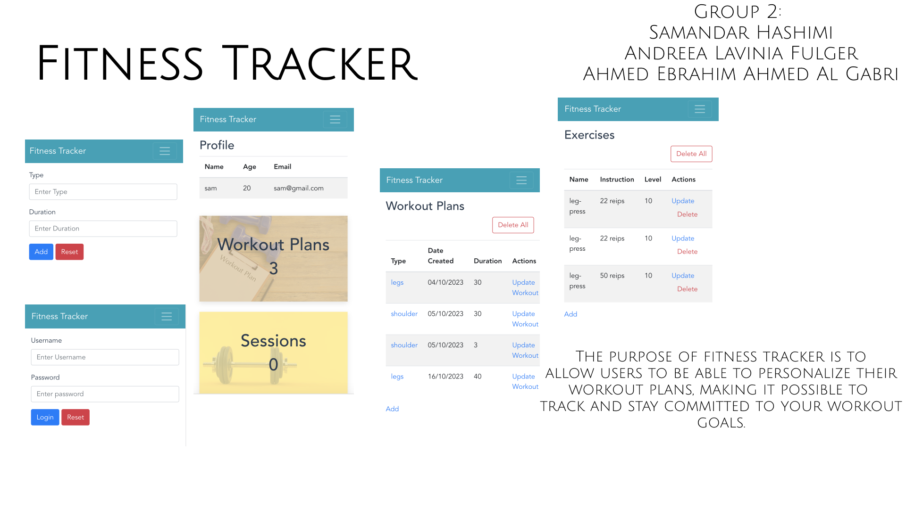

# Accessible Fitness Management System

A full-stack web application designed with comprehensive accessibility features for inclusive fitness management, following Human-Computer Interaction principles.

## Features

### Accessibility Features
- **Visual Accessibility**: Colour blindness support, high contrast themes, and dynamic text resizing
- **Voice Integration**: Text-to-speech and speech-to-text functionality throughout the application
- **Multi-Language Support**: English and Spanish localization with easy language switching
- **Haptic Feedback**: Vibration patterns for user interactions and feedback
- **Biometric Authentication**: Fingerprint recognition for secure device access

### Fitness Management
- **Workout Plans**: Create and manage personalized workout routines
- **Exercise Library**: Comprehensive exercise database with demonstrations
- **Session Tracking**: Schedule and track workout sessions with progress monitoring
- **Media Support**: Upload images and videos for exercise demonstrations

## Technology Stack

### Frontend
- Vue.js 3 with Vue Router
- Custom CSS with accessibility-focused design
- Web Speech API for voice features
- Vibration API for haptic feedback
- Responsive design for multiple devices

### Backend
- Node.js with Express.js framework
- MongoDB database with Mongoose ODM
- Custom session-based authentication system
- File upload handling for media content
- RESTful API architecture

## Project Structure
├── client/ # Vue.js frontend application
│ ├── src/
│ │ ├── views/ # Application pages and components
│ │ ├── locales/ # Multi-language translation files
│ │ └── utils/ # Accessibility utilities
│ └── public/ # Static assets
├── server/ # Node.js backend application
│ ├── src/
│ │ ├── controllers/ # API route handlers
│ │ ├── models/ # Database models
│ │ ├── middleware/ # Authentication and validation
│ │ └── services/ # Business logic
└── docs/ # Project documentation

# Setup backend
cd server && npm install
npm run dev

# Setup frontend
cd client && npm install
npm run serve

## System Definition (MS0)

### Purpose

This program is intended to provide a platform for managing fitness and 
 allowing users to plan, monitor and improve their exercise regimens. By providing a customized fitness journey, users can have personalized training programs made up of a variety of workout sessions and exercises. The purpose of this system is to provide a systematic approach to fitness to encourage users to stick to their fitness plans and goals, allowing users to keep track of their fitness progress.

**Access Application**

Frontend: http://localhost:8080

Backend API: http://localhost:3000

**API Documentation**
The backend provides RESTful endpoints for:

User authentication and session management

Workout plan creation and management

Exercise library management

Session scheduling and tracking

User preference storage
**
Accessibility Compliance**
_This application follows WCAG 2.1 AA guidelines and includes:_

Screen reader compatibility

Keyboard navigation support

Colour Blindness mode compliance

Text scaling up to 200%

Alternative text for all media

Caption support for videos

### Entity-Relationship (ER) Diagram

## Teaser (MS3)

